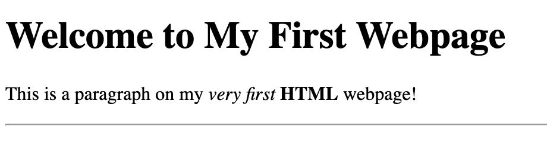
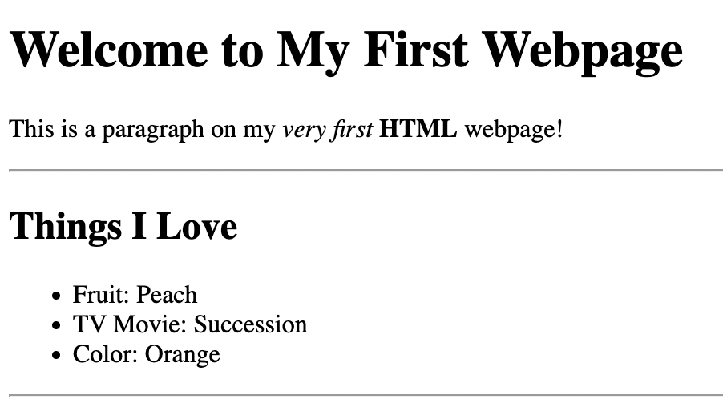
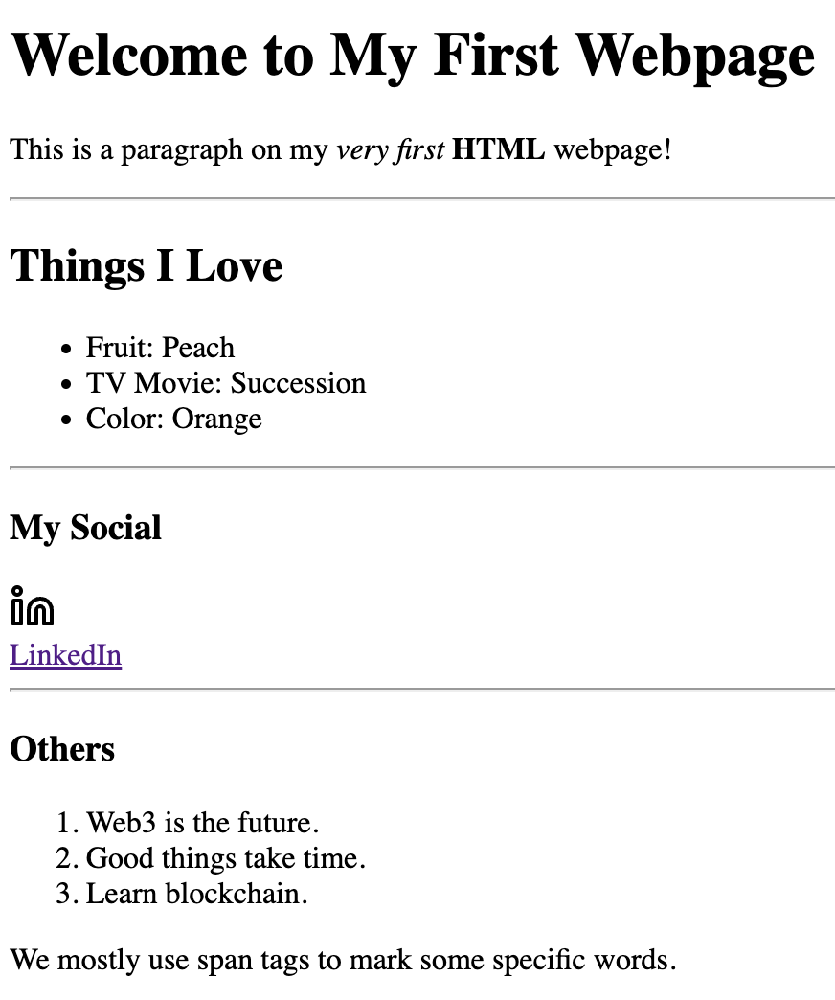
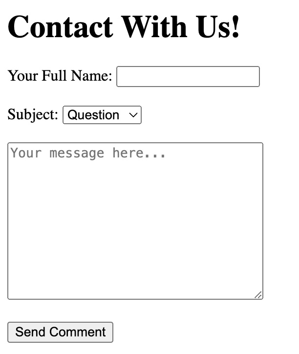
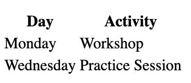
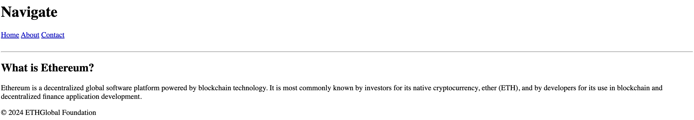
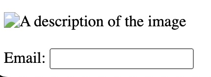

# **Week 2 / HTML 101**

# Part 1

- In this part, you will learn;
  - The basic HTML tags,
  - The basic elements of a webpage,
  - Basic HTML concepts you need to know,
  - Creating your very (for real) first personal webpage

<br>

## Step 1: Let's Get Started!

In this step, you will use the following tags:

- **`<!DOCTYPE html>`:** Tells the browser that this is an HTML5 document.
- **`<html>`:** The opening tag that starts your HTML document.
- **`<head>`:** Contains meta information about the page (you don’t see this part on the page).
- **`<title>`:** This is the text that will show in the browser tab.
- **`<body>`:** This is where the visible content of your webpage goes.
- **`<h1> - <h6>`:** This is a heading. The number 1 means it’s the largest size of heading.
- **`<p>`:** This is a paragraph. It contains some text that will be displayed on the webpage.
- **`<strong>` or `<b>`:** This tag is used to indicate strong importance or seriousness. By default, it renders the text in **bold**.
- **`<em>` or `<i>`:** This tag is used to emphasize text. By default, it is displayed in _italic_ style.
- **`<hr>`:** This tag is used to create a horizontal rule or horizontal line.

And you will create this:



<br>

## Step 2: Other levels of heading tags, unordered lists

In this step, you will add the following tags to your webpage:

- **`<h2>`:** A second-level heading (smaller than `<h1>`).
  - h1 > h2 > h3 > h4 > h5 > h6
- **`<ul>`:** Stands for “unordered list,” used to create a bulleted list.

  - Example:

    ```
        <ul>
            <li>First item</li>
            <li>Second item</li>
            <li>Third item</li>
        </ul>
    ```

  - This will display a list with bullets.

- **`<li>`:** Stands for “list item,” used inside `<ul>` to list each item.

And you will create this:



<br>

## Step 3: Links & images

- **`<a>`:** Stands for "anchor," and is used to create a hyperlink to another webpage or location.

  - Example:`<a href="https://www.example.com">Click here</a>` - The text "Click here" will be clickable and link to https://www.example.com.

- **``:** Stands for "image," and is used to add pictures to your webpage.

  - Example: `` - This displays an image from the file "image.jpg" and uses the "alt" attribute to provide a description for accessibility.

It will look like this:



<br>

## Step 4: Ordered Lists, `<div>` and `<span>` Tags

- **`<ol>`:** Stands for "ordered list," used to create a numbered list.

  - Example:

    ```
        <ol>
            <li>First item</li>
            <li>Second item</li>
            <li>Third item</li>
        </ol>
    ```

    - This will display a list with numbers (1, 2, 3, etc.).

- **`<div>`:** Stands for "division," used to group sections of content together. ,

  - Example:

    ```
    <div>
        <h2>Title in a div</h2>
        <p>Some text inside the div.</p>
    </div>
    ```

    - This groups the heading and paragraph inside one block.

- **`<span>`:** Stands for "span," used to group inline elements or text.

  - Example: `<p>This is a <span style="color: red;">red</span> word in a sentence.</p>`
    - This changes the style of just part of the text within a paragraph.

And finally, it will finally look like this:


**🎉 Congratulations! You have successfully completed the activity of the Part 1!**

## Step 5: Crucial Concepts / Features of the HTML

- You don't have to fully understand this step, but it would be great if you read and get familiar with the following must-to-know HTML features.
- These features will be explained in detail in the future. So, don't worry if you can't comprehend what's going on.

### 5.1. Self-Closing Tags (Void Elements)

- Almost every HTML tags have both an opening and a closing tag.
  - Example:
    `<h1>Don't forget to close your tag</h1>`
- Also, there are some some tags called "self-closing" (or void elements). These tags don't need a closing tag **because they don’t have any content between an opening and closing tag**.
- Examples:
  - `` - Used to embed images:
    - ``
  - `<br>` - Inserts a line break:
    - `This is a line break<br>Next line starts here.`
  - `<hr>` - Inserts a horizontal rule (line):
    - `<hr>`
  - `<input>` - Used for various form inputs like text, buttons, checkboxes, etc:
    - `<input type="text" placeholder="Enter your name">`
  - `<meta>` - Provides metadata about the HTML document (used in the `<head>` section):
    - `<meta charset="UTF-8">`
  - `<link>` - Links to external resources, such as stylesheets:
    - `<link rel="stylesheet" href="styles.css">`

### 5.2. Element Types

In HTML, elements are typically classified as block or inline elements, and the display property in CSS can modify this behavior. Here's an explanation of block and inline-block behavior:

#### 1. Block Elements

- Block-level elements occupy the full width of their parent container, stretching across from left to right (even if the content doesn't fill the entire width).
- Block elements always start on a new line, pushing any following elements to the next line.
- You can set width and height on block elements.
- Common block elements include `<div>`, `<p>`, `<h1>`, `<section>`, `<article>`, etc.
- Example:
  ```
    <div>This is a block element.</div>
    <div>Another block element.</div>
  ```
- Each `<div>` will appear on a new line and take up the entire width of the container.

#### 2. Inline Elements

- Inline elements only take up as much width as necessary to fit their content, without forcing a line break.
- They don’t start on a new line, so they can sit alongside other inline elements.
- You cannot set width and height on inline elements directly.
- Common inline elements include `<span>`, `<a>`, `<strong>`, `<em>`, etc.
- Example:
  ```
    <span>This is an inline element.</span>
    <span>Another inline element.</span>
  ```
- Both `<span>` elements will appear **_on the same line_**, fitting only as much space as needed.

#### 3. Inline-Block Elements

- Inline-block elements _behave like inline elements_ but **allow you to set their width and height** (similar to block elements).
- Unlike block elements, they don’t force a new line, so you can have multiple inline-block elements on the same line.
- They maintain inline flow but have block-level properties such as customizable dimensions and margins (spaces).
- Example:

  ```
    <span style="display: inline-block; width: 100px; height: 50px;">Inline-block element</span>

    <span style="display: inline-block; width: 100px; height: 50px;">Another inline-block element</span>
  ```

- Both inline-block elements will appear on the same line, but you can control their size and dimensions like block elements.

<br>

---

---

<br>

# Part 2

In this part, you will learn:

- Form elements to capture user input.
- Tables to display data in rows and columns.
- Semantic HTML elements for better structure and accessibility.
- Accessibility basics in HTML to improve user experience for all.

<br>

## Step 1: Forms and Inputs

In this step, you will use the following tags to create a simple contact form:

- **`<form>`:** Defines a form that collects user input.
- **`<input>`:** A versatile tag for different input fields (text, email, password, etc.).
  - Example: `<input type="text" placeholder="Enter your name">`
- **`<label>`:** A label that describes an input field, helping with accessibility.
  - Example: `<label for="name">Name:</label>`
- **`<button>`:** Defines a clickable button to submit the form.
  - Example: `<button type="submit">Submit</button>`
- **`<textarea>`:** Used for multiline text input.
  - Example: `<textarea placeholder="Enter your message"></textarea>`
- **`<select>` and `<option>`:** Used to create dropdown menus for selecting options.
  - Example:
    ```html
    <label for="subject">Subject:</label>
    <select id="subject">
      <option value="question">Question</option>
      <option value="feedback">Feedback</option>
    </select>
    ```

**Activity:** Create a contact form that includes name, email, message, and a dropdown for selecting the subject.

You should create a form that looks like this:



<br>

## Step 2: Tables

In this step, you will create a simple table to display a schedule:

- **`<table>`:** Defines the structure of a table.
- **`<tr>`:** Stands for "table row," used to define each row.
- **`<td>`:** Stands for "table data," defines a cell in the table.
- **`<th>`:** Stands for "table header," defines a header cell (usually bold and centered by default).

  Example:

  ```html
  <table>
    <tr>
      <th>Day</th>
      <th>Activity</th>
    </tr>
    <tr>
      <td>Monday</td>
      <td>Workshop</td>
    </tr>
    <tr>
      <td>Wednesday</td>
      <td>Practice Session</td>
    </tr>
  </table>
  ```

Your table should look like this now:



## Step 3: Semantic HTML

In this step, we will explore Semantic HTML tags that help structure your webpage meaningfully:

- **`<header>`:** Defines the header section of a webpage. It typically contains the site's name or logo and navigation links.
- **`<nav>`:** Used to define a section that contains navigation links.
- **`<section>`:** Groups related content together in a section.
- **`<article>`:** Represents independent content such as blog posts or articles that can stand on their own.
- **`<footer>`:** Defines the footer section of a webpage, usually containing things like copyright information, links, and contact details.

Here is an example that incorporates semantic elements:

```html
<header>
  <h1>My Website</h1>
  <nav>
    <a href="#">Home</a>
    <a href="#">About</a>
    <a href="#">Contact</a>
  </nav>
</header>

<section>
  <article>
    <h2>Article Title</h2>
    <p>This is an article about something interesting.</p>
  </article>
</section>

<footer>
  <p>&copy; 2024 My Website</p>
</footer>
```

It will look like this: 



## Step 4: Accessibility Basics

Accessibility ensures that everyone, including people with disabilities, can use your website effectively. Here are a few key practices:

### 4.1. Alt Text for Images

Always include an `alt` attribute in your `` tags to describe the image content. This helps screen readers interpret the image for visually impaired users.

- **Example:**

  ```html
  
  ```

- The `alt` attribute provides a short description of the image content.

### 4.2. Form Labels

Always link `<label>` tags to their corresponding `<input>` elements using the `for` attribute. This ensures that users with assistive devices understand the relationship between labels and form fields.

- **Example:**

  ```html
  <label for="email">Email:</label> <input type="email" id="email" />
  ```

- The `for` attribute in the `<label>` corresponds to the `id` attribute of the `<input>` field, creating an accessible relationship between the two.

### Why Accessibility Matters:

1. **Inclusive Design:** Ensures that your webpage can be accessed and used by people with disabilities.
2. **SEO Benefits:** Accessible websites often rank better in search engines.
3. **Legal Compliance:** Many countries require websites to be accessible under various laws and regulations.

It will look like this:



<br>

**🎉 Congratulations! You have successfully completed the activity of the Part 2!**
